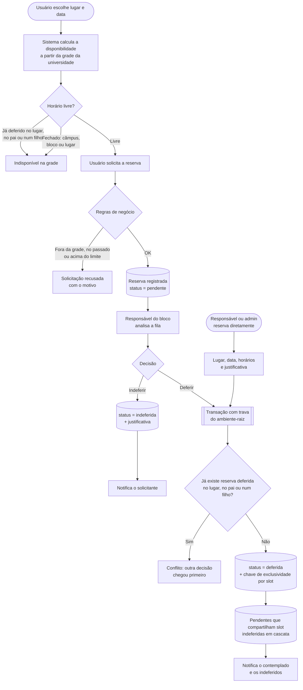
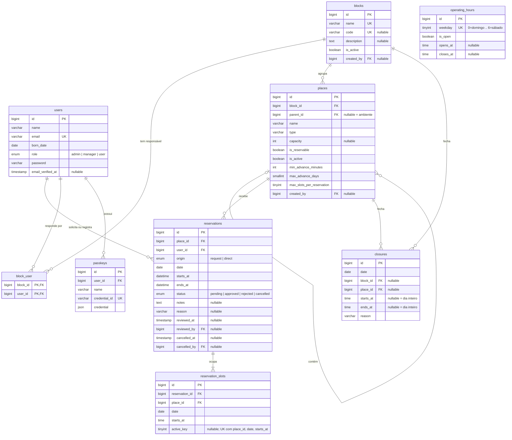

# Sistema de Reserva de Ambientes

Aplicação web para reserva de ambientes institucionais (auditórios, quadras, salas de reunião, laboratórios e outros espaços físicos), desenvolvida em Laravel com Livewire.

- Autor: Luiz Gustavo de Oliveira Santiago
- Instituição: UTFPR
- Disciplina: Desenvolvimento de Aplicações Backend com Framework

## Motivação

A reserva de espaços físicos em instituições costuma ser feita de forma manual ou informal (e-mail, planilhas, papel), o que gera conflitos de horário, falta de visibilidade sobre a disponibilidade e retrabalho para quem administra os ambientes.

Além do problema em si, o tema foi escolhido porque o meu Trabalho de Conclusão de Curso terá um tema semelhante. Este projeto funciona, portanto, como base técnica e de aprendizado para o TCC, permitindo validar a modelagem, o fluxo de reservas e a stack escolhida antes do trabalho final.

## Objetivos

### Objetivo geral

Desenvolver um sistema web que centralize o cadastro de ambientes e o processo de solicitação, deferimento e acompanhamento de reservas, eliminando conflitos de horário e dando visibilidade da disponibilidade aos usuários.

### Objetivos específicos

- Permitir que administradores cadastrem ambientes e definam a grade de horários em que cada um pode ser reservado.
- Permitir que usuários autenticados solicitem reservas de ambientes em datas e horários específicos.
- Garantir que não existam duas reservas deferidas para o mesmo ambiente em intervalos sobrepostos.
- Implementar o fluxo de deferimento das solicitações por parte do administrador.
- Notificar os usuários por e-mail sobre o andamento de suas solicitações.
- Oferecer a visualização da ocupação de cada ambiente por data.
- Aplicar na prática os conceitos da disciplina: rotas, controllers, models, migrations, autenticação, autorização, validação e envio de e-mails com o framework Laravel.

## Funcionalidades

### Perfis de usuário

| Perfil | O que faz |
|---|---|
| Administrador | Monta a estrutura física (blocos, ambientes e subambientes) e decide o que aceita reserva; nomeia os responsáveis de bloco; cria contas de responsável e de administrador; edita a grade de funcionamento; e, em qualquer bloco, faz tudo o que um responsável faz |
| Responsável de bloco | No bloco sob sua responsabilidade: defere ou indefere solicitações, reserva diretamente um ambiente ou subambiente com justificativa, cancela reservas com motivo, cadastra fechamentos e acompanha a agenda. Não solicita reservas |
| Usuário comum | Cria a própria conta, consulta ambientes e disponibilidade, solicita reservas, acompanha e cancela as próprias solicitações |

### Requisitos priorizados

Priorização por MoSCoW. O levantamento completo, com os 50 requisitos funcionais, os não funcionais e a matriz de rastreabilidade, está em [docs/requisitos.md](docs/requisitos.md).

| Funcionalidade | Descrição | Prioridade |
|---|---|---|
| Autenticação | Cadastro público de usuários, login, recuperação de senha e verificação de e-mail | Must |
| Estrutura física | Administrador cadastra blocos, ambientes e subambientes, e define quais aceitam reserva | Must |
| Responsáveis de bloco | Administrador nomeia os responsáveis e cria as contas de responsável e de administrador | Must |
| Grade de funcionamento | Janela única da universidade, por dia da semana, que toda reserva respeita | Must |
| Solicitação de reserva | Usuário escolhe ambiente ou subambiente, data e horários disponíveis | Must |
| Verificação de conflito | Impede duas reservas deferidas no mesmo lugar e horário - inclusive entre um ambiente e seus subambientes | Must |
| Deferimento | Responsável do bloco, ou administrador, defere ou indefere as solicitações; deferir uma indefere as concorrentes | Must |
| Reserva direta | Responsável ou administrador reserva um lugar diretamente, com justificativa, sem passar pela fila | Must |
| Minhas reservas | Usuário acompanha o status das solicitações e cancela as próprias reservas | Must |
| Agenda e cancelamento | Responsável e administrador veem a ocupação e cancelam reservas com motivo | Must |
| Notificação por e-mail | Envio de e-mail ao solicitar, deferir, indeferir ou cancelar | Should |
| Fechamentos | Feriado, manutenção ou evento fecha o câmpus, um bloco ou um lugar, em uma data ou faixa de horário | Should |
| Painel inicial | Resumo das próximas reservas do usuário e das solicitações pendentes do responsável | Could |
| Relatório de ambientes mais utilizados | Estatísticas de ocupação por ambiente | Won't |

## Fluxo de reserva

O sistema não confirma a reserva no ato: a solicitação nasce **pendente** e depende da decisão do responsável pelo bloco - ou do administrador, que decide em qualquer bloco. Três decisões definem o comportamento do fluxo.

**Uma solicitação pendente não reserva o horário.** Vários usuários podem solicitar o mesmo horário, e todas as solicitações ficam visíveis a quem decide, que escolhe qual atender. O horário só deixa de aceitar novas solicitações quando alguma delas é deferida.

**Deferir uma solicitação indefere automaticamente as concorrentes.** Ao deferir, o sistema localiza as demais solicitações pendentes que compartilham algum horário com ela (no mesmo lugar, no ambiente-pai ou nos subambientes), indefere cada uma registrando a justificativa de que outra solicitação foi atendida, e notifica os usuários afetados. Ninguém fica esperando uma resposta que não virá.

**Quem gere não pede: reserva.** Responsável e administrador não entram na fila. Eles escolhem lugar, data e horários e registram a reserva já deferida, com justificativa. A reserva direta passa pela mesma trava e dispara a mesma cascata - o banco não distingue quem está reservando.



Os diagramas completos dos três perfis estão em [docs/fluxos.md](docs/fluxos.md).

## Estado da implementação

O projeto está em desenvolvimento. O que já funciona no repositório é a base do starter kit: autenticação com Fortify (login, cadastro, recuperação de senha, autenticação em dois fatores e passkeys), telas de perfil e aparência, e o cadastro estendido com data de nascimento e perfil de acesso.

A verificação de e-mail está habilitada no Fortify e tem as telas correspondentes, mas ainda **não é obrigatória**: o model `User` não implementa `MustVerifyEmail`, então nenhum e-mail de verificação é disparado e o middleware `verified` não barra ninguém. Tornar a verificação efetiva é tarefa da fase de implementação.

**A modelagem descrita na próxima seção é o alvo da Sprint 1, não o estado atual do banco.** Quem clonar o projeto agora e rodar as migrations encontrará o esquema da modelagem inicial, anterior às decisões de 26/09/2026:

- Não existem blocos, subambientes, responsáveis nem grade de funcionamento. `places` é uma tabela plana, com `nome`, `bloco` (texto), `capacidade` e `descricao`.
- `place_schedules` guarda faixas fixas por ambiente - a grade ainda não é única.
- `reservations` aponta para uma linha da grade (`schedule_id` + `date`), e sua restrição `UNIQUE (schedule_id, date)` faz a primeira solicitação **pendente** travar o horário - o oposto da regra descrita em *Fluxo de reserva*.
- `role` só conhece `admin` e `user`; não há `manager`.

A migração para o esquema abaixo é o conteúdo da Sprint 1.

## Banco de dados

Modelo relacional em MySQL. As tabelas de infraestrutura do framework (`sessions`, `password_reset_tokens`, `cache`, `jobs` e derivadas) foram omitidas do diagrama por não fazerem parte do domínio.



### Diagrama no dbdiagram.io

O mesmo esquema, acrescido de `sessions` e `password_reset_tokens`, está em [docs/database.dbml](docs/database.dbml) no formato DBML. Para visualizar ou editar, cole o conteúdo do arquivo no editor do [dbdiagram.io](https://dbdiagram.io).

<details>
<summary>Ver o DBML</summary>

```dbml
// ============================================================
// Sistema de Reserva de Ambientes - UTFPR, Backend 2
// Diagrama para importar em https://dbdiagram.io
//
// Este arquivo espelha o bloco DBML do README.md. Ao alterar um,
// altere o outro.
//
// Revisão de 26/09/2026: hierarquia bloco -> ambiente -> subambiente,
// perfil de responsável de bloco, grade única de funcionamento,
// reserva direta e exclusividade por slot (reservation_slots).
// ============================================================

// ---------- Enums ----------

Enum role {
  admin
  manager [note: 'responsável de bloco']
  user
}

Enum reservation_status {
  pending
  approved
  rejected
  cancelled
}

Enum reservation_origin {
  request [note: 'solicitada por usuário comum e submetida a deferimento']
  direct  [note: 'registrada diretamente por admin ou responsável, já deferida']
}

// ---------- Pessoas ----------

Table users {
  id                        bigint       [pk, increment]
  name                      varchar
  email                     varchar      [unique, not null]
  born_date                 date         [not null]
  role                      role         [not null, default: 'user']
  email_verified_at         timestamp    [null]
  password                  varchar
  two_factor_secret         text         [null]
  two_factor_recovery_codes text         [null]
  two_factor_confirmed_at   timestamp    [null]
  remember_token            varchar(100) [null]
  created_at                timestamp
  updated_at                timestamp

  Note: 'Cadastro público cria role = user. Contas manager e admin são criadas pelo admin.'
}

// ---------- Estrutura física ----------

Table blocks {
  id          bigint       [pk, increment]
  name        varchar(120) [unique, not null]
  code        varchar(20)  [unique, null, note: 'sigla curta, ex.: B1, LAB']
  description text         [null]
  is_active   boolean      [not null, default: true]
  created_by  bigint       [null, ref: > users.id]
  created_at  timestamp
  updated_at  timestamp

  Note: 'Bloco é organização: não recebe reserva. Agrupa ambientes e define quem é responsável.'
}

Table block_user {
  block_id   bigint    [not null, ref: > blocks.id]
  user_id    bigint    [not null, ref: > users.id]
  created_at timestamp

  Indexes {
    (block_id, user_id) [pk]
  }

  Note: 'Responsáveis por bloco. Um usuário pode responder por mais de um bloco; um bloco pode ter mais de um responsável.'
}

Table places {
  id                        bigint       [pk, increment]
  block_id                  bigint       [not null, ref: > blocks.id, note: 'em subambiente, igual ao do pai']
  parent_id                 bigint       [null, ref: > places.id, note: 'NULL = ambiente; preenchido = subambiente']
  name                      varchar(120) [not null]
  type                      varchar(40)  [not null, note: 'sala | laboratório | auditório | quadra | ...']
  description               text         [null]
  capacity                  int          [null]
  is_reservable             boolean      [not null, default: true, note: 'admin decide o que aceita reserva']
  is_active                 boolean      [not null, default: true]
  min_advance_minutes       int          [not null, default: 0, note: 'só vale para solicitação de usuário']
  max_advance_days          smallint     [not null, default: 30, note: 'só vale para solicitação de usuário']
  max_slots_per_reservation tinyint      [not null, default: 1, note: 'só vale para solicitação de usuário']
  created_by                bigint       [null, ref: > users.id]
  created_at                timestamp
  updated_at                timestamp

  Indexes {
    (block_id, parent_id)
    (block_id, is_active)
  }

  Note: '''
  Ambiente e subambiente na mesma tabela. Profundidade máxima 2: subambiente não tem filhos.
  Nome único entre irmãos é validado na aplicação, parent_id NULL não colide em índice único.
  '''
}

// ---------- Grade e fechamentos ----------

Table operating_hours {
  id         bigint    [pk, increment]
  weekday    tinyint   [unique, not null, note: '0=domingo .. 6=sábado']
  is_open    boolean   [not null, default: false]
  opens_at   time      [null]
  closes_at  time      [null]
  updated_at timestamp

  Note: '''
  Grade única da universidade, válida para todos os blocos e lugares.
  Padrão: seg a sex 06:00 às 23:00, sáb e dom fechados.
  Os slots (60 min) são gerados em memória a partir da janela do dia; nada é materializado.
  '''
}

Table closures {
  id         bigint       [pk, increment]
  date       date         [not null]
  block_id   bigint       [null, ref: > blocks.id]
  place_id   bigint       [null, ref: > places.id]
  starts_at  time         [null, note: 'nulo = dia inteiro']
  ends_at    time         [null, note: 'nulo = dia inteiro']
  reason     varchar(160) [not null]
  created_by bigint       [null, ref: > users.id]
  created_at timestamp
  updated_at timestamp

  Indexes {
    date
    (block_id, date)
    (place_id, date)
  }

  Note: '''
  Feriado, manutenção, evento. O escopo vem do par (block_id, place_id):
  ambos nulos = câmpus inteiro; só block_id = o bloco; place_id = o lugar (e seus filhos).
  '''
}

// ---------- Reservas ----------

Table reservations {
  id           bigint             [pk, increment]
  place_id     bigint             [not null, ref: > places.id, note: 'ambiente ou subambiente']
  user_id      bigint             [not null, ref: > users.id, note: 'quem solicitou, ou quem registrou a reserva direta']
  origin       reservation_origin [not null, default: 'request']
  date         date               [not null, note: 'data local da reserva']
  starts_at    datetime           [not null, note: 'UTC; derivado de date + primeiro slot']
  ends_at      datetime           [not null, note: 'UTC; derivado de date + fim do último slot']
  status       reservation_status [not null, default: 'pending']
  notes        text               [null, note: 'justificativa do solicitante; obrigatória na reserva direta']
  reason       varchar(255)       [null, note: 'motivo do indeferimento ou cancelamento']
  reviewed_at  timestamp          [null]
  reviewed_by  bigint             [null, ref: > users.id, note: 'admin ou responsável do bloco']
  cancelled_at timestamp          [null]
  cancelled_by bigint             [null, ref: > users.id]
  created_at   timestamp
  updated_at   timestamp

  Indexes {
    (place_id, date)
    (user_id, starts_at)
    status
  }

  Note: 'Reserva direta nasce approved, com origin = direct, reviewed_by = user_id e reviewed_at = created_at.'
}

Table reservation_slots {
  id             bigint  [pk, increment]
  reservation_id bigint  [not null, ref: > reservations.id]
  place_id       bigint  [not null, ref: > places.id, note: 'copiado da reserva para compor o índice único']
  date           date    [not null]
  starts_at      time    [not null, note: 'início do slot, alinhado à grade']
  active_key     tinyint [null, note: '1 quando a reserva está deferida; NULL caso contrário']

  Indexes {
    (place_id, date, starts_at, active_key) [unique]
    reservation_id
  }

  Note: '''
  Uma linha por slot reservado: uma solicitação de 14h às 17h gera três linhas.
  O índice único só colide entre linhas com active_key = 1, porque NULL nunca colide:
  é o que permite várias solicitações pendentes no mesmo slot e garante, no banco,
  que só uma delas seja deferida. Cancelar devolve active_key a NULL.
  Bloqueio entre ambiente e subambiente é garantido pela transação com trava no ambiente-raiz.
  '''
}

// ---------- Autenticação e infraestrutura (Laravel + Fortify) ----------

Table passkeys {
  id            bigint    [pk, increment]
  user_id       bigint    [not null, ref: > users.id]
  name          varchar
  credential_id varchar   [unique, not null]
  credential    json
  last_used_at  timestamp [null]
  created_at    timestamp
  updated_at    timestamp
}

Table sessions {
  id            varchar     [pk]
  user_id       bigint      [null, ref: > users.id]
  ip_address    varchar(45) [null]
  user_agent    text        [null]
  payload       longtext
  last_activity int
}

Table password_reset_tokens {
  email      varchar   [pk]
  token      varchar
  created_at timestamp [null]
}
```

</details>

### Tabelas

| Tabela | Papel |
|---|---|
| `users` | Usuários do sistema. `role` distingue administrador, responsável de bloco (`manager`) e usuário comum. O cadastro público cria `user`; as outras contas, o administrador cria |
| `blocks` | Blocos. São organização, não recebem reserva: agrupam ambientes e têm responsáveis |
| `block_user` | Quem responde por qual bloco (N:N) |
| `places` | Ambientes e subambientes, na mesma tabela: `parent_id` nulo é ambiente. Guarda os parâmetros que limitam a solicitação do usuário |
| `operating_hours` | A grade única da universidade: uma linha por dia da semana, com a janela de funcionamento. Padrão seg a sex, 06h às 23h |
| `closures` | Fechamentos: feriado, manutenção, evento. O escopo vem do par `block_id`/`place_id` - ambos nulos fecha o câmpus |
| `reservations` | Solicitações, reservas diretas e seu desfecho, com o registro de quem decidiu, indeferiu ou cancelou |
| `reservation_slots` | Uma linha por slot reservado. É onde o banco garante a exclusividade |
| `passkeys` | Chaves de login sem senha (WebAuthn), fornecidas pelo starter kit. Não faz parte do domínio de reservas |

### Decisões de modelagem

- **A grade é única e guarda a regra, não os horários.** `operating_hours` tem uma linha por dia da semana com a janela de funcionamento da universidade. Os slots de 60 minutos são calculados dessa janela no momento da consulta - 17 valores por dia, nada materializado. Não existe grade por ambiente: todo lugar funciona no horário da universidade.
- **Ambiente e subambiente são a mesma coisa em níveis diferentes.** Uma tabela `places` com `parent_id` resolve os dois sem polimorfismo. Reservar o ambiente ocupa todos os seus subambientes; reservar um subambiente ocupa parcialmente o pai. Dois subambientes irmãos não se afetam. Bloco não entra nessa conta: é organização.
- **Responsável é uma relação, não só um papel.** `role = manager` diz o que a pessoa é; `block_user` diz de quais blocos ela cuida. A autorização para deferir, reservar diretamente, cancelar ou fechar consulta a pivô - o administrador passa direto.
- **Solicitação pendente não ocupa o horário.** `active_key` fica nulo em `reservation_slots` enquanto a reserva está pendente, indeferida ou cancelada. Várias pessoas podem disputar o mesmo slot, e o responsável decide.
- **A exclusividade é garantida pelo banco, slot a slot.** `UNIQUE (place_id, date, starts_at, active_key)` torna impossível duas reservas deferidas no mesmo lugar e slot, mesmo que duas pessoas defiram ao mesmo tempo - e mesmo em reservas de vários horários, porque cada slot é uma linha. O bloqueio entre ambiente e subambiente é garantido pela transação, que trava o ambiente-raiz antes de decidir. A verificação em PHP existe para dar uma mensagem amigável, não para garantir a regra.
- **Deferir indefere as concorrentes, e reservar diretamente também.** As duas operações rodam na mesma transação: registrar a decisão, indeferir as pendentes que compartilham slot (no lugar, no pai ou nos filhos) e notificar os envolvidos acontecem juntos ou não acontecem. `origin` registra se a reserva veio da fila ou de um registro direto.
- **Nada é apagado.** Indeferimento e cancelamento são mudanças de status com registro de autor, data e motivo. `restrictOnDelete` impede apagar um lugar com reservas; lugares saem de circulação por `is_active = false`.
- **Enums no banco** (`role`, `status`, `origin`) em vez de tabelas de apoio: são listas curtas e fechadas, espelhadas em `app/Enums/`.
- **Horas de parede e instantes são coisas diferentes.** `opens_at`, `closes_at` e o `starts_at` de `reservation_slots` são horas locais, sem fuso. `starts_at` e `ends_at` de `reservations` são instantes, gravados em UTC e exibidos em `America/Sao_Paulo`.

## Tecnologias

- PHP 8.3
- Laravel 13
- Livewire 4 com Flux UI
- Tailwind CSS 4
- MySQL
- Docker (Laravel Sail)

## Artefatos de engenharia de software

| Artefato | Local |
|---|---|
| Levantamento e priorização de requisitos (MoSCoW) | [docs/requisitos.md](docs/requisitos.md) |
| Relatório de arquitetura e regras de negócio | [docs/arquitetura-reservas.md](docs/arquitetura-reservas.md) |
| Diagramas de fluxo e de sequência | [docs/fluxos.md](docs/fluxos.md) |
| Modelagem do banco de dados | [Seção Banco de dados](#banco-de-dados) e [docs/database.dbml](docs/database.dbml) |
| Planejamento de sprints | [docs/sprints.md](docs/sprints.md) |
| Guia de estilo da interface | [STYLE_GUIDE.md](STYLE_GUIDE.md) |
| Diagrama de classes | `docs/diagrama-classes.png` (a ser adicionado) |
| Protótipos de telas | [docs/prototipos/](docs/prototipos/) - 21 capturas: os três perfis em notebook, a disponibilidade em quatro larguras e o modo escuro |

## Planejamento

O desenvolvimento está organizado em cinco sprints de duas semanas, de 08/09 a 16/11/2026.

| Sprint | Período | Tema |
|---|---|---|
| 1 | 08/09 a 21/09 | Fundação de dados: schema, models, factories e seeder |
| 2 | 22/09 a 05/10 | Disponibilidade, solicitação, deferimento e autorização |
| 3 | 06/10 a 19/10 | Área administrativa: ambientes, grade, bloqueios e fila de solicitações |
| 4 | 20/10 a 02/11 | Área do usuário: busca, disponibilidade, solicitação e acompanhamento |
| 5 | 03/11 a 16/11 | Qualidade e entrega: testes, acessibilidade, artefatos e vídeo |

Detalhamento em [docs/sprints.md](docs/sprints.md).

## Vídeo de apresentação

Vídeo de até 3 minutos apresentando a proposta, os objetivos e as funcionalidades planejadas:

LINK_DO_VIDEO (a ser adicionado)

## Como executar localmente

Pré-requisitos: Docker e Docker Compose. O projeto usa Laravel Sail, que sobe a aplicação e o MySQL em containers.

```bash
git clone https://github.com/LuizGustavoSantiagoo/UTFPR_BACKEND2_RESERVAS.git
cd UTFPR_BACKEND2_RESERVAS

cp .env.example .env
docker run --rm -v "$(pwd):/var/www/html" -w /var/www/html laravelsail/php83-composer:latest composer install

./vendor/bin/sail up -d
./vendor/bin/sail artisan key:generate
./vendor/bin/sail artisan migrate --seed
./vendor/bin/sail npm install
./vendor/bin/sail npm run dev
```

A aplicação ficará disponível em `http://localhost:8000` (a porta vem de `APP_PORT` no `.env`).

Alternativamente, com `make` instalado, todo o setup acima é feito com um único comando, e `make help` lista os demais atalhos (`up`, `down`, `fresh`, `dev`, `test`):

```bash
make setup
make dev
```

### Usuário de teste

O seeder cria hoje um único usuário, com perfil de **administrador**:

- E-mail: `test@example.com`
- Senha: `12345678`

Um segundo usuário, com perfil comum, será criado pelo seeder junto com os ambientes de exemplo na Sprint 1. Até lá, para testar o perfil comum, altere o `role` do usuário acima ou crie uma conta pela tela de cadastro.

### Notas de ambiente

- **E-mail:** `MAIL_MAILER=log` no `.env.example`. As notificações não são enviadas de verdade em desenvolvimento - o conteúdo aparece em `storage/logs/laravel.log`.
- **Fuso horário:** a aplicação roda em UTC. A exibição em `America/Sao_Paulo` descrita nas decisões de modelagem é requisito da fase de implementação (RNF16), ainda não configurada.
- **Idioma:** `APP_LOCALE=en` no `.env.example`. A padronização em pt-BR é requisito da Sprint 5 (RNF12).
