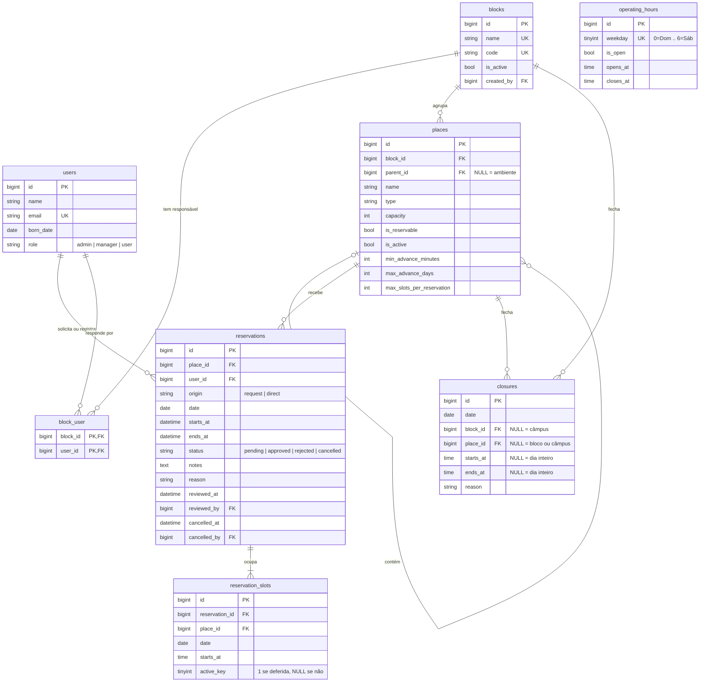
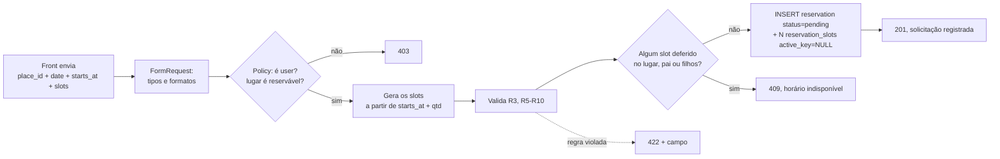
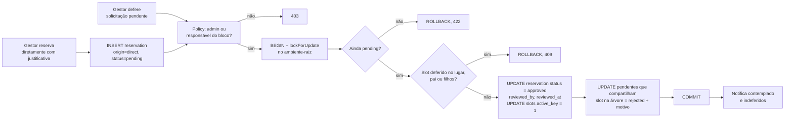

# Sistema de Reserva de Ambientes: Relatório de Arquitetura

> Documento de arquitetura e análise. Não contém código-fonte.
> Stack alvo detectada no repositório: **Laravel 13 + Livewire 4 + Flux + MySQL** (starter kit Livewire, autenticação via Fortify já pronta).
>
> Artefato de entrega, referenciado pelo [README](../README.md) e pelo [levantamento de requisitos](requisitos.md).
>
> **Revisão de 07/09/2026.** O deferimento passou a ser obrigatório: a solicitação pendente **não** bloqueia o horário, e deferir uma solicitação indefere as concorrentes (divergência D1 em [requisitos.md](requisitos.md)).
>
> **Revisão de 26/09/2026.** Entrevista com o autor (divergências D4 a D6): a estrutura física passa a ser **bloco -> ambiente -> subambiente**; entra o perfil de **responsável de bloco**, que decide sobre o seu bloco e pode **reservar diretamente**; e a grade de funcionamento deixa de ser por ambiente e vira **única, da universidade**. As seções 0, 2, 3, 4, 5 e 6 foram reescritas. A seção 1 continua apontando para [fluxos.md](fluxos.md).

---

## 0. Decisões de nomenclatura (antes de tudo)

O relatório inteiro usa esta convenção. `Place` continua sendo "o lugar reservável" - agora um ambiente ou um subambiente, na mesma tabela.

| Conceito de negócio | Tabela | Model |
|---|---|---|
| Bloco (prédio, setor) | `blocks` | `Block` |
| Ambiente e subambiente | `places` | `Place` - `parent_id` nulo é ambiente |
| Responsável de bloco | `block_user` (pivô) + `users.role = manager` | `User::managedBlocks()` |
| Grade de funcionamento da universidade | `operating_hours` | `OperatingHour` |
| Fechamento (feriado, manutenção, evento) | `closures` | `Closure` |
| Reserva (solicitação ou direta) | `reservations` | `Reservation` |
| Slot reservado | `reservation_slots` | `ReservationSlot` |
| Usuário | `users` | `User` |

**Sobre a migration atual de `places`** (`nome`, `bloco`, `capacidade`, `descricao`): ela é substituída inteira na Sprint 1, não corrigida. O campo `bloco`, que era texto, volta como chave estrangeira - a intuição original estava certa, só faltava a tabela.

**Sobre `place_schedules` e `place_exceptions`**: as duas saem. A primeira porque não há mais grade por ambiente; a segunda porque o fechamento ganhou escopo (câmpus, bloco ou lugar) e virou `closures`.

---

## 1. Diagramas de Fluxo do Sistema (Mermaid.js)

Movidos para [fluxos.md](fluxos.md).

---

## 2. Modelagem de Dados e Relacionamentos

### 2.1 Diagrama Entidade-Relacionamento



### 2.2 Detalhamento das entidades

#### `users`
Do starter kit, com duas colunas a mais.

| Coluna | Tipo | Notas |
|---|---|---|
| `born_date` | date, not null | do cadastro |
| `role` | enum `admin` \| `manager` \| `user`, default `user`, index | O cadastro público grava `user`. `manager` e `admin` só nascem pela tela do administrador |

> **`manager` é o que a pessoa é; `block_user` diz de quais blocos ela cuida.** Um `manager` sem linha na pivô é um responsável ainda não vinculado - pode entrar, mas a fila dele está vazia. A autorização para decidir consulta a pivô, nunca só o `role` (RNF05).

#### `blocks`

| Coluna | Tipo | Regra |
|---|---|---|
| `name` | string(120), **unique** | |
| `code` | string(20), unique, nullable | Sigla curta para listas e filtros |
| `description` | text, nullable | |
| `is_active` | boolean, default true | Bloco inativo esconde todos os seus lugares da busca |
| `created_by` | FK para `users.id`, nullable, `nullOnDelete` | Auditoria |

Bloco **não recebe reserva**. É organização: agrupa lugares e define quem decide.

#### `block_user` (responsáveis)

Pivô pura: `block_id`, `user_id`, `created_at`, chave primária composta. Um usuário pode responder por mais de um bloco; um bloco pode ter mais de um responsável. Não precisa de model - `belongsToMany` nos dois lados resolve.

#### `places` (ambientes e subambientes)

| Coluna | Tipo | Regra |
|---|---|---|
| `block_id` | FK para `blocks.id`, `restrictOnDelete`, index | Em subambiente, **igual ao do pai** - o service garante |
| `parent_id` | FK para `places.id`, nullable, `restrictOnDelete` | `NULL` = ambiente; preenchido = subambiente |
| `name` | string(120) | Único entre irmãos, validado na aplicação (ver nota) |
| `type` | string(40), index | sala, laboratório, auditório, quadra... |
| `description` | text, nullable | |
| `capacity` | unsigned int, nullable | Filtro "capacidade mínima" |
| `is_reservable` | boolean, default true | O administrador decide o que aceita reserva. Um ambiente pode ser só um agrupador de subambientes |
| `is_active` | boolean, default true, index | Soft-disable sem apagar histórico |
| `min_advance_minutes` | unsigned int, default 0 | Só para solicitação de usuário |
| `max_advance_days` | unsigned smallint, default 30 | Só para solicitação de usuário |
| `max_slots_per_reservation` | unsigned tinyint, default 1 | Só para solicitação de usuário |
| `created_by` | FK para `users.id`, nullable, `nullOnDelete` | |

**Índices:** `(block_id, parent_id)`, `(block_id, is_active)`.

> **Por que uma tabela só.** Ambiente e subambiente têm as mesmas colunas e o mesmo ciclo de vida; a única diferença é ter ou não um pai. Duas tabelas exigiriam `reservations.reservable_type/reservable_id` (polimorfismo) e duas consultas em toda tela. Com `parent_id`, "tudo que ocupa o ambiente X" é `place_id IN (X, filhos de X)` e "tudo que ocupa o subambiente Y" é `place_id IN (Y, pai de Y)`.

> **Nome único entre irmãos.** `UNIQUE (block_id, parent_id, name)` não funciona: no MySQL, `NULL` em `parent_id` nunca colide, então dois ambientes "Sala 1" no mesmo bloco passariam. Valide no `FormRequest` com `Rule::unique('places')->where('block_id', ...)->where('parent_id', ...)`.

> **Profundidade.** Dois níveis, e só (RN23). O service recusa `parent_id` que aponte para um lugar que já tem pai. Não há necessidade técnica de mais - e cada nível a mais dobra o custo da checagem de ocupação.

#### `operating_hours` (a grade da universidade)

| Coluna | Tipo | Regra |
|---|---|---|
| `weekday` | tinyint 0 a 6, **unique** | 0 = domingo ... 6 = sábado |
| `is_open` | boolean, default false | |
| `opens_at` / `closes_at` | time, nullable | Obrigatórios quando `is_open`; `closes_at > opens_at`; ambos alinhados à hora cheia |

**Sete linhas, e só.** Seed: segunda a sexta `is_open = true`, `06:00` às `23:00`; sábado e domingo `is_open = false`. O administrador edita pela tela; ninguém insere ou apaga linhas.

O slot é fixo em **60 minutos** - `config('reservations.slot_minutes')`, não coluna. Com a janela padrão, cada dia útil tem exatamente 17 slots: 06:00, 07:00, ..., 22:00. Nada é materializado: os 17 valores são calculados da janela no momento da consulta.

> **Por que não uma tabela de períodos (M1...N5).** A instituição reserva por janela de hora cheia, não por período de aula. Uma tabela de códigos só faria sentido se os slots fossem irregulares. Se a lacuna L11 de [requisitos.md](requisitos.md) for respondida com "50 minutos", a mudança é o valor da constante e a validação de alinhamento - a estrutura não muda.

#### `closures` (fechamentos)

| Coluna | Tipo | Regra |
|---|---|---|
| `date` | date, index | |
| `block_id` | FK para `blocks.id`, nullable, `cascadeOnDelete` | |
| `place_id` | FK para `places.id`, nullable, `cascadeOnDelete` | |
| `starts_at` / `ends_at` | time, nullable | Ambos `NULL` = dia inteiro; senão, alinhados à hora cheia |
| `reason` | string(160) | Exibido ao usuário |
| `created_by` | FK para `users.id`, nullable | Auditoria - quem fechou |

**Escopo pelo par `(block_id, place_id)`:**

| `block_id` | `place_id` | Alcance |
|---|---|---|
| `NULL` | `NULL` | Câmpus inteiro |
| preenchido | `NULL` | Todos os lugares do bloco |
| - | preenchido | O lugar **e seus filhos** (se for ambiente) |

**Índices:** `date`, `(block_id, date)`, `(place_id, date)`.

Um feriado é **uma** linha. Na modelagem anterior era uma por ambiente.

#### `reservations`

| Coluna | Tipo | Regra |
|---|---|---|
| `place_id` | FK para `places.id`, `restrictOnDelete`, index | Ambiente ou subambiente |
| `user_id` | FK para `users.id`, `cascadeOnDelete`, index | Quem solicitou - ou quem registrou a reserva direta |
| `origin` | enum `request` \| `direct`, default `request` | Solicitação de usuário, ou registro direto de responsável/admin |
| `date` | date | Data **local** da reserva. Evita a armadilha "23h em São Paulo é dia seguinte em UTC" nas consultas por dia |
| `starts_at` / `ends_at` | datetime, UTC | Derivados de `date` + primeiro slot e `date` + fim do último. Para exibição e ordenação |
| `status` | enum, default `pending`, index | `pending` \| `approved` \| `rejected` \| `cancelled` |
| `notes` | text, nullable | Justificativa do solicitante. **Obrigatória** quando `origin = direct` |
| `reason` | string(255), nullable | Motivo do indeferimento ou do cancelamento |
| `reviewed_at` / `reviewed_by` | timestamp / FK nullable | Quem decidiu. Na reserva direta, `reviewed_by = user_id` e `reviewed_at = created_at` |
| `cancelled_at` / `cancelled_by` | timestamp / FK nullable | Distingue cancelamento do titular vs. do gestor |

**Índices:** `(place_id, date)`, `(user_id, starts_at)`, `status`.

**Não há mais `active_key` aqui.** Ela desceu para `reservation_slots`, onde a exclusividade é slot a slot.

#### `reservation_slots` (o livro-razão da exclusividade)

| Coluna | Tipo | Regra |
|---|---|---|
| `reservation_id` | FK para `reservations.id`, `cascadeOnDelete` | |
| `place_id` | FK para `places.id` | **Copiado** da reserva, para compor o índice único |
| `date` | date | Idem |
| `starts_at` | time | Início do slot, alinhado à grade |
| `active_key` | tinyint, **nullable** | `1` quando a reserva está `approved`; `NULL` caso contrário |

**Índice único: `(place_id, date, starts_at, active_key)`.**

Uma solicitação de 14h às 17h gera uma linha em `reservations` e três aqui (14:00, 15:00, 16:00). Enquanto pendente, as três têm `active_key = NULL` e não colidem com nada - nem entre si, nem com as de outra solicitação para o mesmo horário. No deferimento, as três recebem `active_key = 1` na mesma transação; se qualquer uma colidir com uma linha já deferida, a transação inteira falha e a reserva não é deferida pela metade.

> **Por que uma linha por slot e não uma chave por reserva.** Uma `active_key` única por reserva só garante que duas reservas com o **mesmo** início não coexistam. Uma reserva 14h às 17h e outra 15h às 16h têm inícios diferentes e passariam pelo índice. Por slot, o banco enxerga a sobreposição parcial sem nenhuma aritmética de intervalo.

### 2.3 As relações, explicadas

| Relação | Cardinalidade | Chave | Justificativa |
|---|---|---|---|
| `Block` -> `Place` | 1:N | `places.block_id` | Um bloco agrupa muitos lugares |
| `Place` -> `Place` | 1:N, auto-relação, opcional | `places.parent_id` | Ambiente contém subambientes. Profundidade 2 |
| `User` <-> `Block` | **N:N** | `block_user` | Quem responde por qual bloco. Pivô pura, sem atributos |
| `User` -> `Reservation` | 1:N | `reservations.user_id` | Titular: quem solicitou ou quem registrou diretamente |
| `Place` -> `Reservation` | 1:N | `reservations.place_id` | |
| `Reservation` -> `ReservationSlot` | 1:N, obrigatório | `reservation_slots.reservation_id` | Toda reserva tem ao menos um slot |
| `Block` / `Place` -> `Closure` | 1:N, opcional | `closures.block_id` / `closures.place_id` | Nulos = escopo mais amplo |
| `User` <-> `Place` | N:N implícito | via `reservations` | "Quais lugares o usuário X já usou" atravessa `reservations`. Não crie pivô separada |

**Sobre o N:N usuário-bloco:** aqui sim é uma pivô pura - a relação não carrega dado próprio além de existir. `belongsToMany` nos dois lados, e `User::managesBlock(int $blockId): bool` como atalho para as policies.

### 2.4 Fuso horário

Três tipos de hora convivem, e misturá-los é a fonte nº 1 de bug de "sumiu uma hora":

| Onde | O que é | Fuso |
|---|---|---|
| `operating_hours.opens_at/closes_at` | Hora de parede ("abre às 6h") | Nenhum - hora local |
| `closures.starts_at/ends_at`, `reservation_slots.starts_at` | Hora de parede | Nenhum - hora local |
| `reservations.date` | Data local | Nenhum |
| `reservations.starts_at/ends_at` | Instante | **UTC** no banco, `America/Sao_Paulo` na tela |

O service combina `date` + `reservation_slots.starts_at` em `America/Sao_Paulo` e converte para UTC ao gravar `reservations.starts_at`. Todas as consultas de disponibilidade e exclusividade usam `date` + hora local; `starts_at`/`ends_at` UTC servem para exibição, ordenação e "passado ou futuro".

---

## 3. Regras de Negócio e Validações

### 3.1 Concorrência: o mesmo slot, duas decisões

**Onde a corrida acontece.** Não na solicitação: solicitações pendentes convivem. Acontece quando duas **decisões** (dois deferimentos, um deferimento e uma reserva direta, ou duas reservas diretas) disputam o mesmo slot ao mesmo tempo. Com a hierarquia, a disputa pode ser entre o ambiente e um subambiente dele.

Defesa em três camadas, da mais barata à mais forte:

**Camada 1: UX (não é garantia).** A fila e a grade são recarregadas antes de abrir a confirmação. Reduz o atrito, não elimina a corrida.

**Camada 2: Transação com lock no ambiente-raiz.** Toda decisão (deferir, reservar diretamente) roda em uma transação que começa com `lockForUpdate()` na linha do **ambiente-raiz** do lugar - o próprio lugar se for ambiente, o pai se for subambiente. Isso serializa todas as decisões da árvore: enquanto A decide sobre o Auditório, B espera, mesmo que B esteja decidindo sobre a Sala de Apoio dentro do Auditório. Quando B entra, a decisão de A já está commitada e a checagem de ocupação de B a encontra -> `409`.

A mesma transação faz quatro coisas, indivisíveis: verifica ocupação no lugar, no pai e nos filhos; grava a decisão (`approved` + `active_key = 1` em cada slot); indefere as pendentes que compartilham slot na mesma árvore; registra `reviewed_at`/`reviewed_by`. Se a cascata ficasse fora e falhasse, sobrariam pendentes disputando um horário já ocupado.

> **Por que travar o ambiente-raiz e não o lugar.** Travar só o subambiente deixaria passar um deferimento simultâneo no ambiente-pai - as duas transações travariam linhas diferentes e nenhuma esperaria a outra. Travar a raiz custa serializar as decisões de uma árvore inteira; como uma árvore raramente recebe duas decisões no mesmo segundo, é o preço certo pela simplicidade.

**Camada 3: Índice único no banco (a rede de segurança).** O lock falha se alguém gravar por outro caminho (seeder, `tinker`, um segundo serviço). Só o banco garante de verdade: `UNIQUE (place_id, date, starts_at, active_key)` em `reservation_slots`. Enquanto pendente, indeferida ou cancelada, `active_key` é `NULL` - e MySQL trata `NULL` como sempre distinto em índice único. Daí as três propriedades que o fluxo exige: várias pendentes convivem no mesmo slot; só uma pode ser deferida; cancelar (volta a `NULL`) devolve o slot sem apagar o histórico.

O que o índice **não** cobre: ambiente vs. subambiente. As linhas têm `place_id` diferentes e não colidem. Essa parte é garantida só pela Camada 2 - por isso o lock é na raiz, e por isso o teste de concorrência da seção 5.3 tem uma variante pai/filho.

**Tratamento no código:** capture `UniqueConstraintViolationException` e traduza para `409 Conflict` com mensagem clara e recarregamento da fila. "Duplicate entry" vazando para o usuário é falha de acabamento.

### 3.2 Cruzamento de disponibilidade

A disponibilidade é uma **diferença de conjuntos sobre chaves de slot** - não há aritmética de intervalos:

```
slots_do_dia  = { opens_at, opens_at + 60min, ..., closes_at - 60min }   <- da operating_hours do weekday
                (vazio se is_open = false)

fechados      = slots cobertos por closures em (date) com escopo:
                câmpus, OU o bloco do lugar, OU o próprio lugar, OU o pai do lugar

ocupados      = reservation_slots.starts_at
                WHERE date = D AND active_key = 1
                AND place_id IN (lugar, pai do lugar, filhos do lugar)

passados      = slots com date + starts_at < agora + min_advance_minutes   <- só para usuário

disponíveis   = slots_do_dia - fechados - ocupados - passados
```

**Três consultas, sempre três** (RNF02): a linha de `operating_hours`, os `closures` do dia que alcançam o lugar, os `reservation_slots` ativos do dia na árvore do lugar. Os IDs de pai e filhos vêm com o `Place` já carregado. Uma consulta por slot é N+1 disfarçado.

**Por que "pai e filhos" e não "pai, filhos e irmãos".** Reservar o Auditório ocupa a Sala de Apoio (filho). Reservar a Sala de Apoio ocupa o Auditório (pai): ninguém pode mais reservar o Auditório inteiro naquele slot. Mas a Sala de Apoio **não** ocupa a Cabine de Som (irmã): as duas cabem no Auditório ao mesmo tempo. Por isso a consulta sobe um nível e desce um nível, e nunca vai para o lado.

**Solicitações pendentes não entram na subtração.** O slot continua disponível para novas solicitações até que alguma seja deferida. A interface pode mostrar "3 solicitações" no slot - é informação útil e não expõe identidade.

**Onde ficou o teste de sobreposição.** Na modelagem anterior, `inicio_A < fim_B AND fim_A > inicio_B` era a regra central, e trocar `<` por `<=` fazia slots adjacentes se rejeitarem. Aqui ele não existe: dois slots ou têm o mesmo `starts_at` ou não têm. A única aritmética que resta é gerar `slots_do_dia` a partir da janela - 17 somas de 60 minutos.

### 3.3 Demais regras de negócio

Correspondem a RN01-RN24 de [requisitos.md](requisitos.md) seção 7.

| # | Regra | Onde validar |
|---|---|---|
| R1 | Só usuário autenticado reserva | Middleware `auth` |
| R2 | Só `admin` cria, edita ou remove bloco, lugar e grade | `BlockPolicy`, `PlacePolicy`, `OperatingHourPolicy` |
| R3 | Toda reserva ocupa slots inteiros da grade, dentro da janela do dia | Service - rejeitar 14:17 e rejeitar 23:00 |
| R4 | Bloco não recebe reserva; só lugar `is_reservable` | Service |
| R5 | Não reservar no passado | Service |
| R6 | Solicitação respeita `min_advance_minutes` | Service - **só `origin = request`** |
| R7 | Solicitação respeita `max_advance_days` | Service - só `request` |
| R8 | Solicitação respeita `max_slots_per_reservation`, contíguos | Service - só `request` |
| R9 | O mesmo usuário não tem duas reservas ativas no mesmo slot, em lugares diferentes | Service |
| R10 | Limite de reservas ativas futuras por usuário comum | Service - configurável, só `request` |
| R11 | Titular cancela só até X horas antes | `ReservationPolicy` |
| R12 | Responsável (seu bloco) e admin cancelam qualquer reserva, com motivo | `ReservationPolicy` |
| R13 | Lugar inativo some da busca, mantém reservas futuras | Scope `active()` |
| R14 | Lugar com reservas não pode ser apagado | `restrictOnDelete` + mensagem amigável |
| R15 | Alterar a grade lista os conflitos; o admin decide | Service de `OperatingHour` |
| R16 | Cancelada ou indeferida preserva autor, data e motivo - nunca `DELETE` | Model |
| R17 | Admin decide em qualquer bloco; responsável só no seu | `ReservationPolicy::approve` - `isAdmin() || managesBlock(place.block_id)` |
| R18 | Pendente não ocupa: só a decisão preenche `active_key` | Service + banco |
| R19 | Decidir indefere as pendentes que compartilham slot - lugar, pai e filhos | Service, na mesma transação |
| R20 | Só `pending` pode ser deferida | Service |
| R21 | Ambiente ocupa filhos; filho ocupa parcialmente o pai; irmãos não se afetam | Service - consulta da seção 3.2 |
| R22 | Responsável e admin não solicitam: reservam diretamente, com justificativa, sem R6-R8 e R10 | `ReservationPolicy::request` nega `manager`/`admin`; `::direct` exige justificativa |
| R23 | Máximo dois níveis: subambiente não tem filhos | Service de `Place` - recusa `parent_id` que já tenha pai |
| R24 | Fechamento tem escopo e alcança os lugares abaixo | Consulta da seção 3.2 |

> **Sobre R22:** é a regra que dá sentido ao perfil. Se o responsável pudesse solicitar e depois deferir a si mesmo, o deferimento seria teatro. Ele reserva diretamente, com justificativa registrada, e a reserva aparece na agenda como `direct` - auditável.

> **Sobre R21:** é a regra que a hierarquia existe para expressar. Sem ela, "subambiente" seria só um nome bonito para "outro ambiente".

---

## 4. Design de API (Endpoints)

Prefixo `/api` para o contrato lógico. Autenticação por sessão (Livewire) ou Sanctum. Códigos: `200` OK, `201` criado, `401` não autenticado, `403` sem permissão, `404` inexistente, `409` conflito de concorrência, `422` validação.

"Gestor" abaixo significa: `admin` em qualquer bloco, ou `manager` no bloco do recurso.

### 4.1 Estrutura física

| Método | Rota | Acesso | Descrição |
|---|---|---|---|
| `GET` | `/api/blocks` | todos | Blocos ativos com contagem de lugares |
| `POST` / `PUT` / `DELETE` | `/api/blocks[/{id}]` | **admin** | CRUD. `DELETE` -> `422` se houver lugares |
| `PUT` | `/api/blocks/{id}/managers` | **admin** | **Substitui** a lista de responsáveis (delete + insert) |
| `GET` | `/api/places` | todos | Lista paginada. `?block_id=&search=&type=&min_capacity=&date=`. Usuário comum vê só ativos e reserváveis |
| `GET` | `/api/places/{id}` | todos | Detalhe + filhos |
| `POST` | `/api/places` | **admin** | Cria ambiente (`parent_id` nulo) ou subambiente. `422` se o pai já for subambiente |
| `PUT/PATCH` | `/api/places/{id}` | **admin** | Atualiza. Trocar `parent_id` de lugar com reservas -> `422` |
| `DELETE` | `/api/places/{id}` | **admin** | `422` se houver reservas ou filhos. Prefira `PATCH is_active=false` |

### 4.2 Grade e fechamentos

| Método | Rota | Acesso | Descrição |
|---|---|---|---|
| `GET` | `/api/operating-hours` | todos | As sete linhas |
| `PUT` | `/api/operating-hours` | **admin** | Substitui a grade. Retorna `409` com as reservas deferidas que ficariam fora e `force=false` |
| `GET` | `/api/closures?from=&to=` | todos | Fechamentos do período, com escopo |
| `POST` | `/api/closures` | gestor | Cria. Admin: qualquer escopo. Responsável: só `block_id` do seu bloco, ou `place_id` dentro dele. Resposta inclui as reservas atingidas |
| `DELETE` | `/api/closures/{id}` | gestor | Remove |

### 4.3 Disponibilidade: o endpoint central

| Método | Rota | Acesso | Descrição |
|---|---|---|---|
| `GET` | `/api/places/{id}/availability?date=YYYY-MM-DD` | todos | Slots do dia |
| `GET` | `/api/places/{id}/availability?from=&to=` | todos | Intervalo, até 31 dias |

**Resposta:** para cada slot: `starts_at`, `ends_at`, `status` (`available` \| `booked` \| `closed` \| `past`), `reason` (motivo do fechamento), `pending_count` (quantas solicitações pendentes já existem) e `reservation_id` **só para gestor**.

Este endpoint é o único lugar onde a regra de disponibilidade vive. O front nunca recalcula.

### 4.4 Reservas

| Método | Rota | Acesso | Descrição |
|---|---|---|---|
| `GET` | `/api/reservations` | user | As próprias. `?status=&upcoming=1` |
| `POST` | `/api/reservations` | **user** | **Solicita.** Body: `place_id`, `date`, `starts_at`, `slots` (qtd. contíguos, default 1), `notes`. `403` para `manager` e `admin` (R22). `409` se algum slot já estiver deferido |
| `POST` | `/api/reservations/{id}/approve` | gestor | **Defere** e indefere as concorrentes. `409` se outra decisão chegou antes; `422` se não estiver mais `pending` |
| `POST` | `/api/reservations/{id}/reject` | gestor | **Indefere.** `reason` obrigatório |
| `POST` | `/api/places/{id}/reservations/direct` | gestor | **Reserva direta.** Body: `date`, `starts_at`, `slots`, `notes` (obrigatório). Nasce `approved`; mesma transação, mesma cascata. `409` como no deferimento |
| `DELETE` | `/api/reservations/{id}` | titular (no prazo) ou gestor | Cancelamento lógico. Gestor: `reason` obrigatório |
| `GET` | `/api/manage/reservations` | gestor | Admin: todas. Responsável: as do seu bloco. `?block_id=&place_id=&user_id=&from=&to=&status=` |
| `GET` | `/api/manage/reservations/pending` | gestor | Fila de pendentes do escopo, agrupadas por lugar, data e slot |

**Fluxo de dados da solicitação (`POST /api/reservations`):**



**Fluxo de dados da decisão: deferimento e reserva direta compartilham o miolo:**



> A reserva direta é "inserir uma solicitação já autorizada e deferi-la na mesma transação". Não é um segundo caminho de escrita - é o mesmo `approve`, com um `INSERT` antes. Isso é o que garante que ela respeite exatamente a mesma exclusividade e dispare exatamente a mesma cascata.

**O que o cliente envia vs. o que o servidor decide:**

| Dado | Origem | Motivo |
|---|---|---|
| `place_id`, `date`, `starts_at`, `slots`, `notes` | cliente | escolha do usuário ou gestor |
| `ends_at`, cada `reservation_slots.starts_at` | **servidor** | derivados da grade - aceitar do cliente permite reservar 8h num slot |
| `user_id` | **servidor** (sessão) | aceitar do cliente permite reservar em nome de terceiros |
| `origin`, `status`, `active_key`, `reviewed_*` | **servidor** | estado interno e trilha de auditoria |
| `block_id` de um lugar, ao autorizar | **servidor** (do `Place`) | aceitar do cliente permite ao responsável decidir fora do seu bloco |

### 4.5 Livewire vs. API REST

O projeto é Livewire 4 + Flux. **Não precisa de duas camadas**: os componentes chamam os Services diretamente; as rotas acima descrevem o contrato lógico. O que não fazer: duplicar a regra de disponibilidade em um Controller e em um Componente.

---

## 5. Estratégia de Implementação

### 5.1 Onde cada lógica mora

```
app/
  Enums/             Role (admin|manager|user), ReservationStatus, ReservationOrigin
  Models/            Block, Place, OperatingHour, Closure, Reservation, ReservationSlot, User
                     -> relacionamentos (parent/children, managedBlocks), casts, scopes
                       (active, reservable, approved, pending, inTree)
  Services/
    AvailabilityService   -> slots do dia - fechados - ocupados - passados  (seção 3.2)
    ReservationService    -> request, approve (com cascata), direct (= insert + approve),
                            reject, cancel: transação, lock na raiz, R3-R10, R17-R22
    PlaceService          -> criar/editar lugar: profundidade, block_id do pai, nome entre irmãos
    OperatingHourService  -> substituir a grade, listando conflitos (R15)
  Policies/
    BlockPolicy, PlacePolicy, OperatingHourPolicy -> admin-only para escrita
    ClosurePolicy         -> admin qualquer escopo; manager só no seu bloco
    ReservationPolicy     -> request (só user), approve/reject/direct (gestor do bloco),
                            cancel (titular no prazo, ou gestor)
  Http/Requests/          -> formato: tipos, obrigatoriedade, alinhamento à hora cheia
  Livewire/               -> telas, sem regra de negócio
```

**Um helper que vale ouro:** `User::managesBlock(int $blockId): bool` - `isAdmin() || managedBlocks->contains($blockId)`. Toda policy de gestor é uma linha chamando isso com `$place->block_id`.

**Regra do "onde valido isso?":**
- Formato -> **FormRequest**
- Permissão, inclusive "é o seu bloco?" -> **Policy**
- Regra de negócio -> **Service, dentro da transação**
- Invariante absoluta -> **Constraint no banco**

### 5.2 Ordem de implementação sugerida

1. **Migrations**, nesta ordem: `role` ganha `manager`; `blocks`; `block_user`; `places` reescrita (com `block_id`, `parent_id`, `is_reservable`); `operating_hours`; `closures`; `reservations`; `reservation_slots` com o índice único. Apagar as migrations de `place_schedules` e da `reservations` antiga.
2. **Enums**: `Role` + `Manager`; `ReservationOrigin` novo.
3. **Models + relacionamentos**: `Place::parent()`/`children()`/`root()`; `User::managedBlocks()`/`managesBlock()`; `Reservation::slots()`. Casts: `time` como string `H:i`; `date` como `date`; `starts_at`/`ends_at` como `datetime`.
4. **Seeder realista:** `operating_hours` seg a sex 06h às 23h; dois blocos com responsáveis diferentes; um admin, dois `manager` (um por bloco), três `user`; um ambiente **com** subambientes e um **sem**; um lugar `is_reservable = false` (o agrupador). Sem isso você testa só o caso fácil.
5. **`AvailabilityService`** + testes. **Comece aqui** - é o núcleo, e é testável sem HTTP.
6. **`ReservationService`**: `request` (simples) -> `approve` com cascata (transação + lock) -> `direct` (reaproveita `approve`) -> `cancel`. Teste de concorrência em MySQL, com a variante pai/filho.
7. **Policies**, com o teste "responsável do bloco A recebe 403 no bloco B".
8. **Telas**: admin (blocos -> lugares -> responsáveis -> grade) -> responsável (fila, reserva direta, agenda, fechamentos) -> usuário (lista -> grade -> confirmação -> minhas reservas).
9. **Notificações** por último.

### 5.3 Testes que realmente pegam bug

1. **Grade:** seg a sex 06h às 23h gera exatamente 17 slots, o primeiro às 06:00 e o último às 22:00; sábado gera zero.
2. **Hierarquia, o teste que a modelagem existe para passar:** deferir no ambiente remove o slot de todos os filhos; deferir no filho remove o slot do pai; deferir no filho **não** remove o slot do irmão.
3. **Concorrência no deferimento (MySQL):** dois deferimentos simultâneos do mesmo slot -> um `200`, um `409`. **Variante:** um no ambiente, outro no subambiente - o resultado tem de ser o mesmo. Em SQLite os dois passam por acidente.
4. **Vários slots:** reserva de 14h às 17h gera três linhas em `reservation_slots`; se **um** deles já estiver deferido, a reserva inteira recebe `409` e nenhuma linha fica com `active_key = 1`.
5. **Cancelar e reservar de novo:** cancelar zera `active_key`; o slot volta a aceitar deferimento sem violar o índice.
6. **Autorização:** `user` -> `403` ao criar bloco, deferir, reservar diretamente; `manager` do bloco A -> `403` ao deferir no bloco B, `200` no A; `manager` -> `403` ao solicitar (R22).
7. **Cascata:** três solicitações no mesmo slot; deferir uma -> as outras duas `rejected` com motivo. Solicitação pendente no **subambiente** também `rejected` ao deferir o **ambiente**.
8. **Reserva direta:** em slot com pendentes -> pendentes `rejected`; em slot deferido -> `409`; ignora `max_advance_days`; sem `notes` -> `422`.
9. **Fechamento:** câmpus remove todos os slots da data em todos os lugares; bloco A não afeta bloco B; fechar o ambiente fecha os filhos.

Sem o nº 2, a hierarquia é decoração. Sem o nº 3 com a variante, o lock pode estar no lugar errado e você não sabe.

### 5.4 Erros comuns a evitar

| Armadilha | Consequência | O certo |
|---|---|---|
| Materializar **todos** os slots possíveis de cada lugar por dia | Milhares de linhas, job de geração, migração a cada mudança de grade | Gerar os 17 valores em memória; materializar só os slots **reservados** (`reservation_slots`) |
| Travar o subambiente em vez do ambiente-raiz | Deferimento no pai e no filho passam juntos | `lockForUpdate()` sempre na raiz |
| Checar ocupação só no próprio lugar | Auditório e Sala de Apoio reservados ao mesmo tempo | `place_id IN (lugar, pai, filhos)` |
| Checar pai, filhos **e irmãos** | Duas cabines do auditório nunca reservadas juntas | Sobe um, desce um, nunca vai para o lado |
| `active_key` por reserva, não por slot | Sobreposição parcial (14h às 17h vs. 15h às 16h) passa pelo índice | Uma linha por slot |
| Autorizar o responsável só pelo `role` | Responsável do bloco A decide no bloco B | `managesBlock($place->block_id)` |
| Aceitar `block_id` do cliente na autorização | Idem, de propósito | Ler do `Place` carregado |
| Deixar o responsável solicitar | Ele defere a si mesmo; o deferimento vira teatro | R22: `manager` e `admin` reservam diretamente, com justificativa |
| Reserva direta por um caminho de escrita separado | Duas regras de exclusividade, que divergem | `direct` = `INSERT` + o mesmo `approve` |
| Confiar no `ends_at` ou nos slots enviados pelo cliente | Usuário reserva 8h num slot | Derivar do `starts_at` + quantidade, alinhado à grade |
| Checar disponibilidade fora da transação | Race condition silenciosa | Dentro, depois do lock |
| `DELETE` físico da reserva | Perde auditoria | `status = cancelled` + `cancelled_by` |
| Índice único sem `active_key` nulo | Só uma pessoa consegue **solicitar** cada slot | `NULL` enquanto pendente |
| Consultar reservas por `starts_at` UTC "do dia" | 23h local vira dia seguinte em UTC e some da grade | Consultar por `date` + hora local |
| Pacote de permissões para três papéis | Dependência e tabelas para dois `if` | `role` + pivô + Policies |

### 5.5 O que **não** construir agora

Deixe para quando alguém pedir: reservas recorrentes, fila de espera, check-in/no-show, relatórios de ocupação, integração com Google Calendar, multi-tenant, terceiro nível de hierarquia, grade por bloco.

> **Terceiro nível e grade por bloco** merecem menção porque são as duas extensões que a modelagem já **suporta sem migração de dados** - `parent_id` aceita profundidade arbitrária, e `operating_hours` pode ganhar um `block_id` nulo. Mas cada uma dobra o custo da consulta de ocupação ou reintroduz a herança de grade que acabou de sair. Só quando houver um pedido real.

**Já deixe** `min_advance_minutes`, `max_advance_days` e `max_slots_per_reservation` como colunas de `places`, mesmo que a primeira tela não os edite. Três inteiros hoje; uma migration e uma refatoração de service a menos amanhã.

---

## 6. Resumo executivo

O sistema inteiro se apoia em cinco decisões:

1. **Uma grade, da universidade.** `operating_hours` tem sete linhas; os 17 slots do dia são calculados dela. Não há grade por ambiente, herança, nem sobrescrita - e por isso não há aritmética de intervalo: disponibilidade é diferença de conjuntos sobre chaves de slot.
2. **Ambiente e subambiente são a mesma tabela.** `places.parent_id` expressa a hierarquia; a ocupação sobe um nível e desce um nível, nunca vai para o lado.
3. **Quem decide é o responsável do bloco.** `role = manager` diz o que a pessoa é; `block_user` diz onde ela manda. Admin passa direto. Responsável e admin não solicitam: reservam diretamente, com justificativa, pelo **mesmo** caminho do deferimento.
4. **Exclusividade é do banco, slot a slot.** `UNIQUE (place_id, date, starts_at, active_key)` em `reservation_slots`, com `active_key` nulo enquanto pendente. O que o índice não vê (pai vs. filho) o lock no ambiente-raiz vê.
5. **Decidir é uma operação atômica de quatro partes:** verificar a árvore, gravar a decisão, indeferir as concorrentes, registrar quem decidiu. Ou as quatro acontecem, ou nenhuma.

O resto é CRUD.
