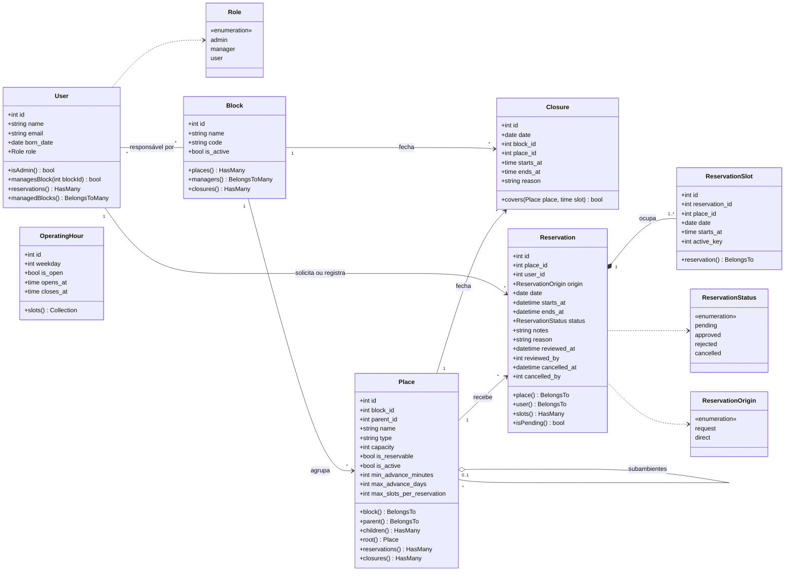

# Sistema de Reserva de Ambientes: Diagrama de Classes

> Complementa o [relatório de arquitetura](arquitetura-reservas.md) (seções 2 e 5.1) e o [DER](database.dbml). Documento de análise; os nomes seguem a convenção da seção 0 do relatório.

Dois diagramas: o **domínio** (models Eloquent e enums, que espelham as tabelas) e a **camada de aplicação** (services e policies, onde a regra de negócio e a autorização vivem). Os models não contêm regra: só estado, relacionamentos e atalhos de consulta.

## 1. Domínio: models e enums

Notas:

- `Place` é ambiente quando `parent_id` é nulo e subambiente quando preenchido. `root()` devolve o ambiente-raiz - a linha que toda decisão trava com `lockForUpdate()`.
- `User` <-> `Block` é a pivô `block_user`: quem responde por qual bloco. `managesBlock()` é o atalho que todas as policies de gestor usam; o administrador passa direto.
- `ReservationSlot` é uma linha por horário reservado. `active_key` vale `1` quando a reserva está deferida e nulo nos demais estados - é aí que o índice único `(place_id, date, starts_at, active_key)` garante a exclusividade.
- `OperatingHour::slots()` gera os 17 horários do dia a partir da janela. Nada é materializado.
- `Closure::covers()` responde se um fechamento alcança um lugar num horário, considerando o escopo (câmpus, bloco ou lugar e seus filhos).

## 2. Aplicação: services e policies

```mermaid
classDiagram
    direction TB

    namespace Services {
        class AvailabilityService {
            +slotsForDay(Place place, date day, User viewer) Collection~Slot~
        }
        class ReservationService {
            +request(User user, Place place, date day, time startsAt, int slots, string notes) Reservation
            +approve(Reservation r, User reviewer) Reservation
            +reject(Reservation r, User reviewer, string reason) Reservation
            +direct(User actor, Place place, date day, time startsAt, int slots, string notes) Reservation
            +cancel(Reservation r, User actor, string reason) Reservation
            -lockRoot(Place place) void
            -assertTreeFree(Place place, date day, Collection slots) void
            -rejectCompeting(Reservation r) void
        }
        class PlaceService {
            +create(Block block, Place parent, array data) Place
            +update(Place place, array data) Place
            -assertDepth(Place parent) void
            -assertSiblingName(Place parent, string name) void
        }
        class OperatingHourService {
            +replace(array rows, bool force) Collection~Reservation~
        }
    }

    namespace Policies {
        class BlockPolicy {
            +create(User u) bool
            +update(User u, Block b) bool
            +delete(User u, Block b) bool
        }
        class PlacePolicy {
            +create(User u) bool
            +update(User u, Place p) bool
            +delete(User u, Place p) bool
        }
        class OperatingHourPolicy {
            +update(User u) bool
        }
        class ClosurePolicy {
            +create(User u, Block b, Place p) bool
            +delete(User u, Closure c) bool
        }
        class ReservationPolicy {
            +request(User u) bool
            +approve(User u, Reservation r) bool
            +reject(User u, Reservation r) bool
            +direct(User u, Place p) bool
            +cancel(User u, Reservation r) bool
        }
    }

    class User
    class Place
    class Reservation
    class ReservationSlot
    class OperatingHour
    class Closure

    AvailabilityService ..> OperatingHour : lê a janela do dia
    AvailabilityService ..> Closure : subtrai fechamentos
    AvailabilityService ..> ReservationSlot : subtrai slots ativos
    ReservationService ..> AvailabilityService : valida R3
    ReservationService ..> Place : lockForUpdate na raiz
    ReservationService ..> Reservation : cria e decide
    ReservationService ..> ReservationSlot : grava active_key
    OperatingHourService ..> OperatingHour
    OperatingHourService ..> ReservationSlot : lista conflitos
    PlaceService ..> Place
    ReservationPolicy ..> User : managesBlock
    ClosurePolicy ..> User : managesBlock
    BlockPolicy ..> User : isAdmin
    PlacePolicy ..> User : isAdmin
    OperatingHourPolicy ..> User : isAdmin
```

Notas:

- `ReservationService::direct` é `INSERT` + `approve` na mesma transação. Não é um segundo caminho de escrita: reserva direta e deferimento passam pela mesma trava e disparam a mesma cascata.
- Os métodos privados do `ReservationService` são as quatro partes atômicas da decisão: travar a raiz, verificar a árvore (lugar, pai e filhos), gravar, indeferir as concorrentes.
- `ReservationPolicy::request` nega `manager` e `admin` (R22); `approve`, `reject` e `direct` exigem `isAdmin()` ou `managesBlock(place.block_id)` (R17).
- Policies não contêm regra de negócio - só respondem "esse usuário pode?". A regra fica no service, dentro da transação, depois do lock.
