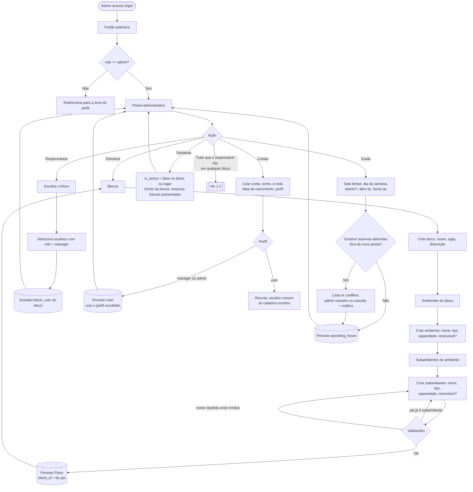
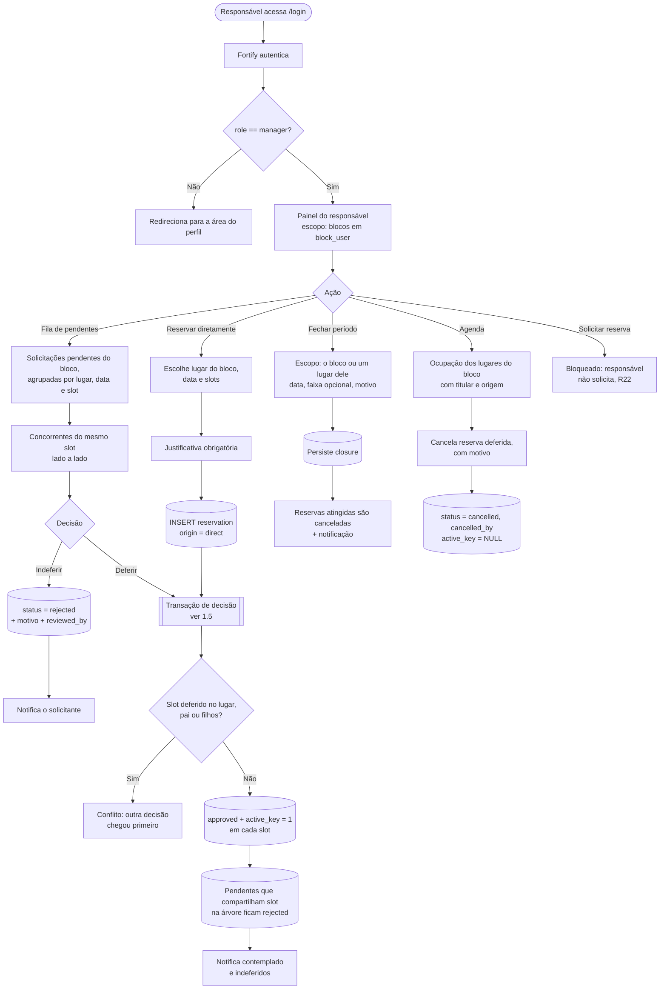
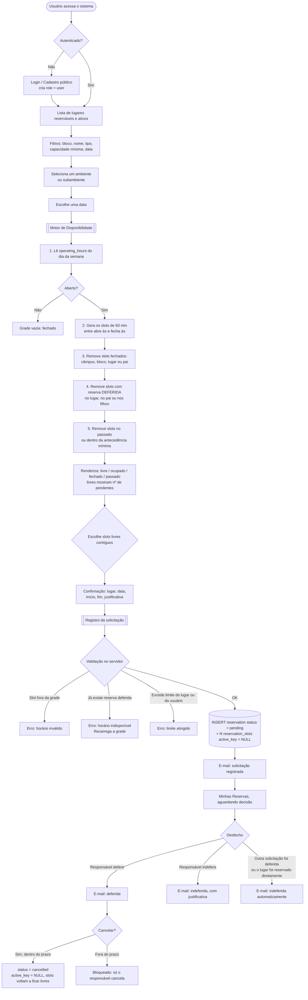
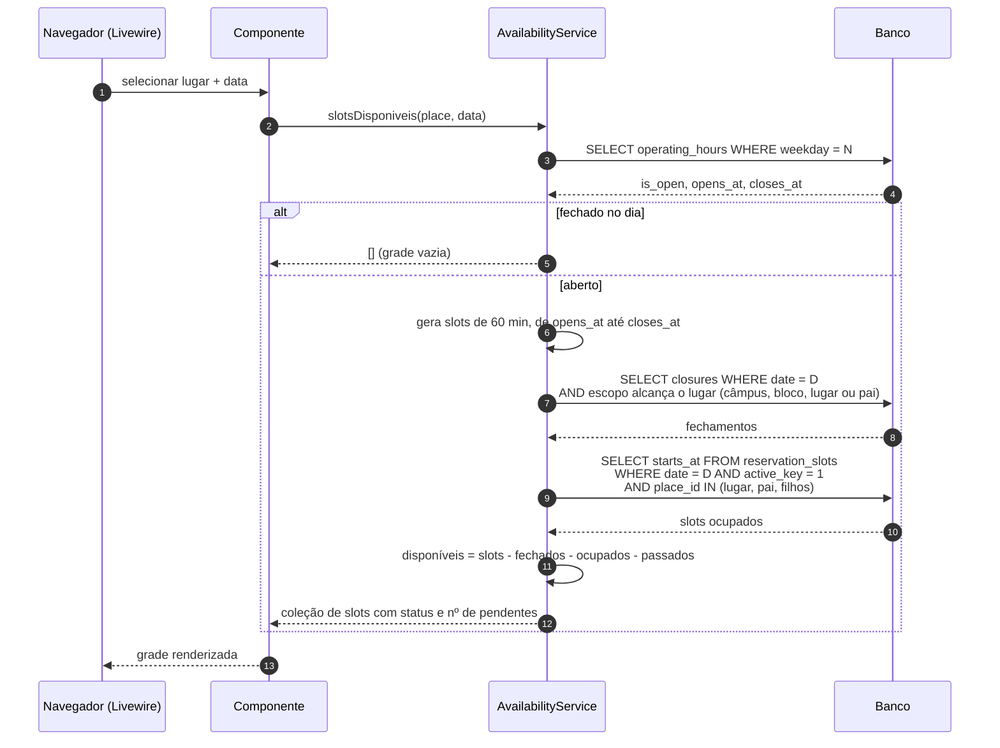
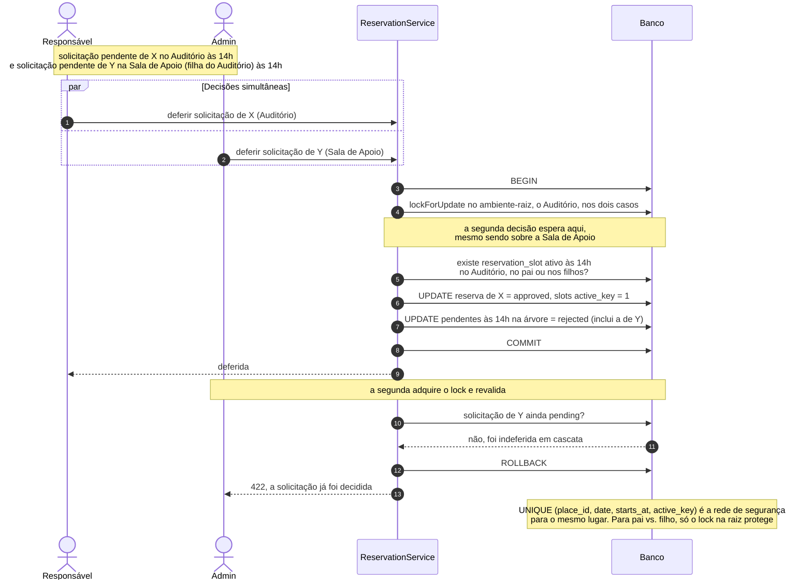
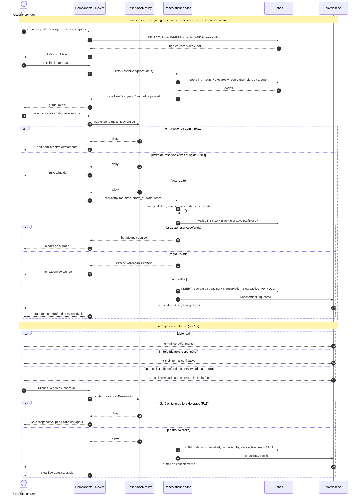
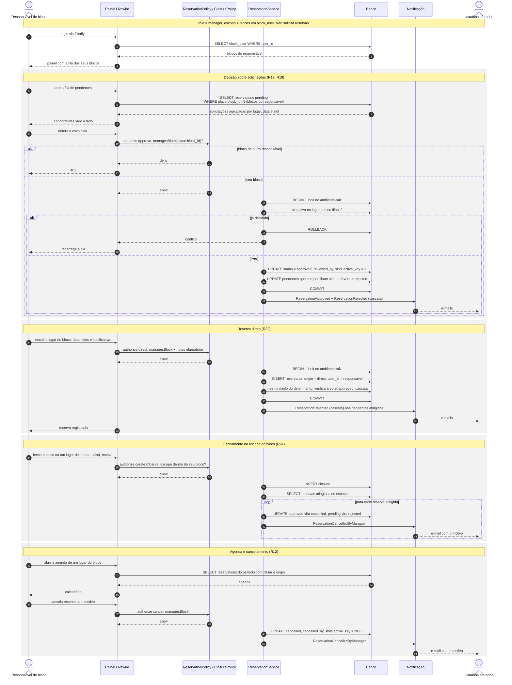
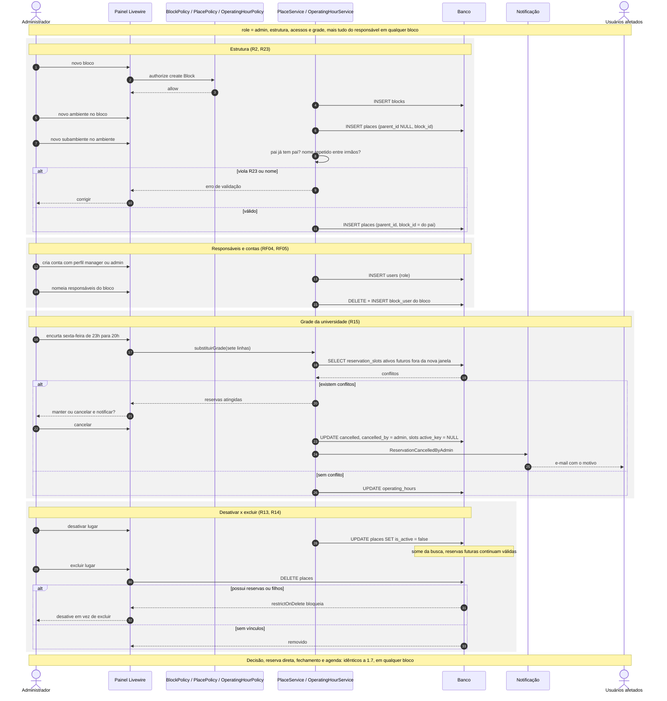

# Sistema de Reserva de Ambientes: Diagramas de Fluxo

> Complementa o [relatório de arquitetura](arquitetura-reservas.md) e o [levantamento de requisitos](requisitos.md).
> Documento de análise. Não contém código-fonte.

O fluxo aqui representado incorpora as decisões de 07/09/2026 (a solicitação nasce **pendente** e não bloqueia o horário; deferir uma indefere as concorrentes, D1) e de 26/09/2026 (hierarquia bloco -> ambiente -> subambiente, perfil de **responsável de bloco**, grade única da universidade e **reserva direta**, D4 a D6). Ver [requisitos.md](requisitos.md) seção 9.

Três perfis, três fluxos: administrador (1.1), responsável de bloco (1.2) e usuário comum (1.3). As sequências 1.4 a 1.8 detalham o motor de disponibilidade, a concorrência e cada perfil.

---

## 1.1 Fluxo do Administrador

## 1.2 Fluxo do Responsável de Bloco

## 1.3 Fluxo do Usuário Comum

## 1.4 Sequência: cálculo de disponibilidade

> Três consultas, sempre três, independentemente de quantos slots o dia tem (RNF02). Solicitações pendentes não removem o slot - elas apenas se acumulam para a decisão do responsável.

## 1.5 Sequência: concorrência na decisão

A corrida não acontece entre dois usuários solicitando: solicitações pendentes convivem. Ela acontece entre duas **decisões** (dois deferimentos, um deferimento e uma reserva direta, ou duas reservas diretas) e, com a hierarquia, pode ser entre o ambiente e um subambiente dele.

## 1.6 Sequência: perfil `user` (usuário comum)

## 1.7 Sequência: perfil `manager` (responsável de bloco)

## 1.8 Sequência: perfil `admin` (administrador)

